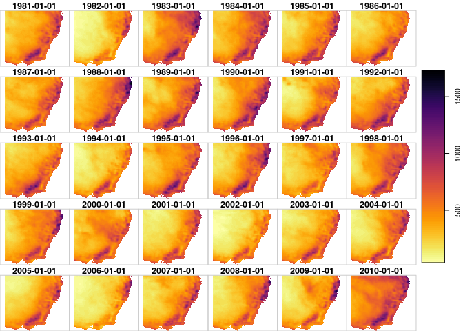
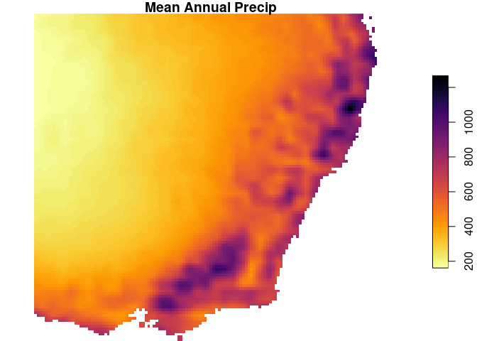
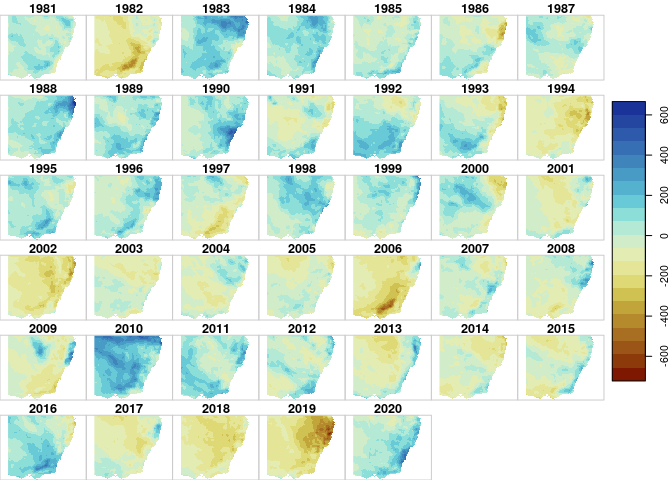

The [`stars`](https://r-spatial.github.io/stars/) library is a
relatively new R framework for spatiotemporal arrays. In this demo, we
will unpack a netcdf file to calculate the annual precipitation
anomalies for southeastern Australia. This can also be effectively
calculated using data frames, however my motivation here is to
demonstrate how the `stars` array based workflow achieve this
calculation faster and use far less memory.

### Load the libraries

``` r
library(tidyverse) # data wrangler
library(stars) # the *star* of this tutorial
library(lubridate) # date wrangler
library(googledrive) # download data
library(scico) # sci-viz color palettes
```

### Download the data

Here is a file with monthly averages for total precip, 2-m air temp, and
2-m dewpoint temperature that I got from the [Copernicus Data
Store](https://cds.climate.copernicus.eu/cdsapp#!/dataset/reanalysis-era5-land-monthly-means?tab=form){:target="\_blank"}
for the ERA5-Land product.  
fyi, the netcdf file is about 44 Mb.  
Note that I am using `stars::read_stars()` instead of `stars::read_ncdf`

``` r
library(googledrive)
temp <- tempfile(fileext = ".nc")
dl <- googledrive::drive_download(
  as_id("1Fo5F--2tfWWZfhTKBOatfM-bDs2stjhB"), path = temp, overwrite = TRUE)
raw <- stars::read_stars(temp)
```

    ## d2m, t2m, tp,

Get summary of the raw file:

``` r
raw
```

    ## stars object with 3 dimensions and 3 attributes
    ## attribute(s), summary of first 1e+05 cells:
    ##     d2m [K]         t2m [K]          tp [m]     
    ##  Min.   :271.7   Min.   :273.6   Min.   :0.000  
    ##  1st Qu.:279.6   1st Qu.:285.4   1st Qu.:0.001  
    ##  Median :281.2   Median :291.8   Median :0.001  
    ##  Mean   :282.5   Mean   :291.9   Mean   :0.002  
    ##  3rd Qu.:285.4   3rd Qu.:297.4   3rd Qu.:0.002  
    ##  Max.   :295.0   Max.   :305.6   Max.   :0.016  
    ##  NA's   :20998   NA's   :20998   NA's   :20998  
    ## dimension(s):
    ##      from  to offset delta  refsys point                    values x/y
    ## x       1 131 140.95   0.1      NA    NA                      NULL [x]
    ## y       1 121 -26.95  -0.1      NA    NA                      NULL [y]
    ## time    1 483     NA    NA POSIXct    NA 1981-01-01,...,2021-03-01

### Convert to mm/month

Following the [ERA5-Land
documentation](https://confluence.ecmwf.int/display/CKB/ERA5-Land%3A+data+documentation#ERA5Land:datadocumentation-accumulationsAccumulations)
for ‘accumulation’ variables:

>   
> The accumulations in synoptic monthly means (stream=mnth) have units
> that include “variable_units per forecast_step hours”. So for
> accumulations in this stream:
>
> The hydrological parameters are in units of “m of water equivalent per
> forecast_step hours” and so they should be multiplied by 1000 to
> convert to kgm-2 per forecast_step hours or mm per forecast_step
> hours.

So if I understood that correctly, we will multiply by 24 hours, and
1000 to get mm per month.

``` r
dp <- raw['tp']*(24*1000)
```

### Aggregate from monthly to yearly sum

``` r
dp_y30 = aggregate(dp %>%
                   filter(time>=ymd("1981-01-01",tz='UTC')) %>%
                   filter(time<ymd("2011-01-01")),
                 by='year', sum)
dim(dp_y30)
```

    ## time    x    y 
    ##   30  131  121

### Plot

always plot! `stars` has nice and fast plotting functions which are
great for sprinkling sanity checks throughout your analyses.

``` r
plot(dp_y30, breaks='equal', col=viridis::inferno(100,direction = -1))
```



### Calculate the Mean Annual Precip along the x & y dimensions

`st_apply` is our workhorse function here. Here we are just calculating
the mean for each grid cell location \~ but we could do more complicated
calculations such as rolling means, band-math, etc.

``` r
dp_map <- st_apply(dp_y30, MARGIN=c('x','y'), FUN=mean)
names(dp_map) <- 'MAP' # update the name
```

### Plot the Mean Annual Precip

``` r
plot(dp_map, breaks='equal', col=viridis::inferno(100,direction = -1),
     main='Mean Annual Precip')
```



``` r
dp_y = aggregate(dp %>%
                   filter(time>=ymd("1981-01-01",tz='UTC')) %>%
                   filter(time<ymd("2021-01-01")),
                 by='year', sum)
dim(dp_y)
```

    ## time    x    y 
    ##   40  131  121

So that is interesting. Any by interesting, I mean it’s a problem. The
order of the dimensions is different from the input.

## Reorder the dimensions as: x,y,time

`aperm` is a standard array transposition function which `stars` can use
to realign our aggregated `stars` object.

``` r
dp_y <- aperm(dp_y, perm = c(2,3,1))
dim(dp_y)
```

    ##    x    y time 
    ##  131  121   40

Great, so now the array dimensions are consistent.

## Now we can do math.

``` r
dp_anom <- dp_y-dp_map
```

    ## Warning in dim(e1) == dim(e2): longer object length is not a multiple of shorter
    ## object length

Note we get the warning because `dp_y` has a time dimension and `dp_map`
does not. But `stars` can do the math so long as we maintain the
standard order of dimensions: x,y,time

Update the name of the variable in `dp_anom` object:

``` r
names(dp_anom) <- 'precip_anom'
dp_anom
```

    ## stars object with 3 dimensions and 1 attribute
    ## attribute(s):
    ##   precip_anom     
    ##  Min.   :-722.57  
    ##  1st Qu.: -91.21  
    ##  Median : -12.99  
    ##  Mean   : -11.32  
    ##  3rd Qu.:  65.29  
    ##  Max.   : 666.14  
    ##  NA's   :138280   
    ## dimension(s):
    ##      from  to offset delta  refsys point                    values x/y
    ## x       1 131 140.95   0.1      NA    NA                      NULL [x]
    ## y       1 121 -26.95  -0.1      NA    NA                      NULL [y]
    ## time    1  40     NA    NA POSIXct    NA 1981-01-01,...,2020-01-01

### Reset the time dimension to year

The time dimension is currently a POSIXct. This could be confused as the
first date of each year, so let’s update them as a numeric corresponding
to the calendar year.

``` r
dp_anom <- dp_anom %>%
  st_set_dimensions(., which = 3, values=1981:2020, names = 'year')
```

### Plot the annual rainfall anomalies for southeastern Australia

``` r
plot(dp_anom,
     join_zlim = T,
     breaks = 'equal',
     col=scico::scico(n=21, palette='roma'))
```



Ok, there are (at least) a couple of things here to nitpick. Should I
have calculated the anomaly by some sort of hydraulic year instead of
calendar year? Yes, probably. It is entirely possible to do this with
`stars`, but I wanted to keep this example short and simple. Should I
have retained the units from the original netcdf? Maybe, but I still
drop them out of habit because I haven’t worked out how to (1) update
them along the workflow, and (2) prevent them from breaking random
functions. Maybe someday…

``` r
sessionInfo()
```

    ## R version 4.0.3 (2020-10-10)
    ## Platform: x86_64-pc-linux-gnu (64-bit)
    ## Running under: Pop!_OS 20.04 LTS
    ## 
    ## Matrix products: default
    ## BLAS:   /usr/lib/x86_64-linux-gnu/openblas-pthread/libblas.so.3
    ## LAPACK: /usr/lib/x86_64-linux-gnu/openblas-pthread/liblapack.so.3
    ## 
    ## locale:
    ##  [1] LC_CTYPE=en_US.UTF-8       LC_NUMERIC=C              
    ##  [3] LC_TIME=en_US.UTF-8        LC_COLLATE=en_US.UTF-8    
    ##  [5] LC_MONETARY=en_US.UTF-8    LC_MESSAGES=en_US.UTF-8   
    ##  [7] LC_PAPER=en_US.UTF-8       LC_NAME=C                 
    ##  [9] LC_ADDRESS=C               LC_TELEPHONE=C            
    ## [11] LC_MEASUREMENT=en_US.UTF-8 LC_IDENTIFICATION=C       
    ## 
    ## attached base packages:
    ## [1] stats     graphics  grDevices utils     datasets  methods   base     
    ## 
    ## other attached packages:
    ##  [1] scico_1.2.0       googledrive_1.0.1 lubridate_1.7.10  stars_0.5-2      
    ##  [5] sf_0.9-8          abind_1.4-5       forcats_0.5.1     stringr_1.4.0    
    ##  [9] dplyr_1.0.5       purrr_0.3.4       readr_1.4.0       tidyr_1.1.3      
    ## [13] tibble_3.1.2      ggplot2_3.3.3     tidyverse_1.3.0  
    ## 
    ## loaded via a namespace (and not attached):
    ##  [1] Rcpp_1.0.6         class_7.3-17       assertthat_0.2.1   digest_0.6.27     
    ##  [5] utf8_1.2.1         R6_2.5.0           cellranger_1.1.0   backports_1.2.1   
    ##  [9] reprex_2.0.0       evaluate_0.14      e1071_1.7-6        highr_0.8         
    ## [13] httr_1.4.2         pillar_1.6.1       rlang_0.4.11       readxl_1.3.1      
    ## [17] rstudioapi_0.13    rmarkdown_2.7      munsell_0.5.0      proxy_0.4-25      
    ## [21] broom_0.7.6        compiler_4.0.3     modelr_0.1.8       xfun_0.22         
    ## [25] pkgconfig_2.0.3    htmltools_0.5.1.1  tidyselect_1.1.1   gridExtra_2.3     
    ## [29] viridisLite_0.4.0  fansi_0.4.2        crayon_1.4.1       dbplyr_2.1.1      
    ## [33] withr_2.4.1        grid_4.0.3         jsonlite_1.7.2     lwgeom_0.2-6      
    ## [37] gtable_0.3.0       lifecycle_1.0.0    DBI_1.1.1          magrittr_2.0.1    
    ## [41] units_0.7-1        scales_1.1.1       KernSmooth_2.23-17 cli_2.4.0         
    ## [45] stringi_1.5.3      cubelyr_1.0.1      viridis_0.6.0      fs_1.5.0          
    ## [49] xml2_1.3.2         ellipsis_0.3.2     generics_0.1.0     vctrs_0.3.8       
    ## [53] tools_4.0.3        glue_1.4.2         hms_1.0.0          parallel_4.0.3    
    ## [57] yaml_2.2.1         colorspace_2.0-0   classInt_0.4-3     rvest_1.0.0       
    ## [61] knitr_1.31         haven_2.3.1
